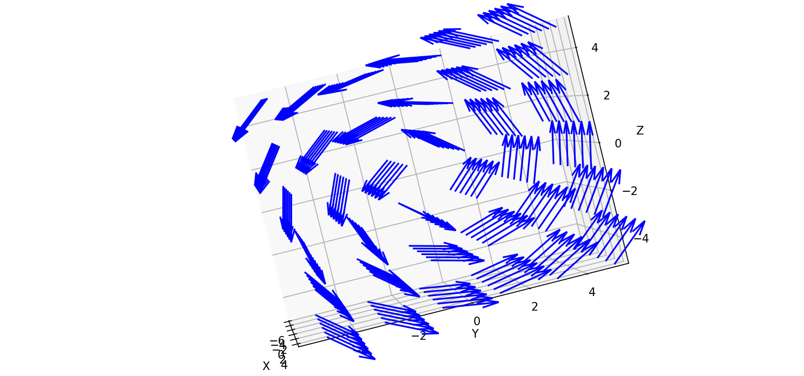

# 3D Vector field Class and Plotter

The Field3 class can be used to plot a 3d vector field with matplotlibs quiver function. Simply define the functions P, Q, and R and run the script to see the vector field plot.